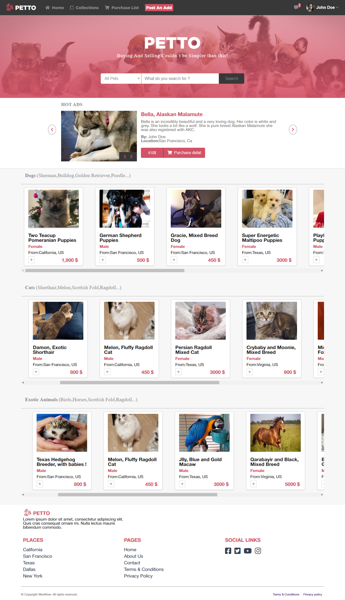
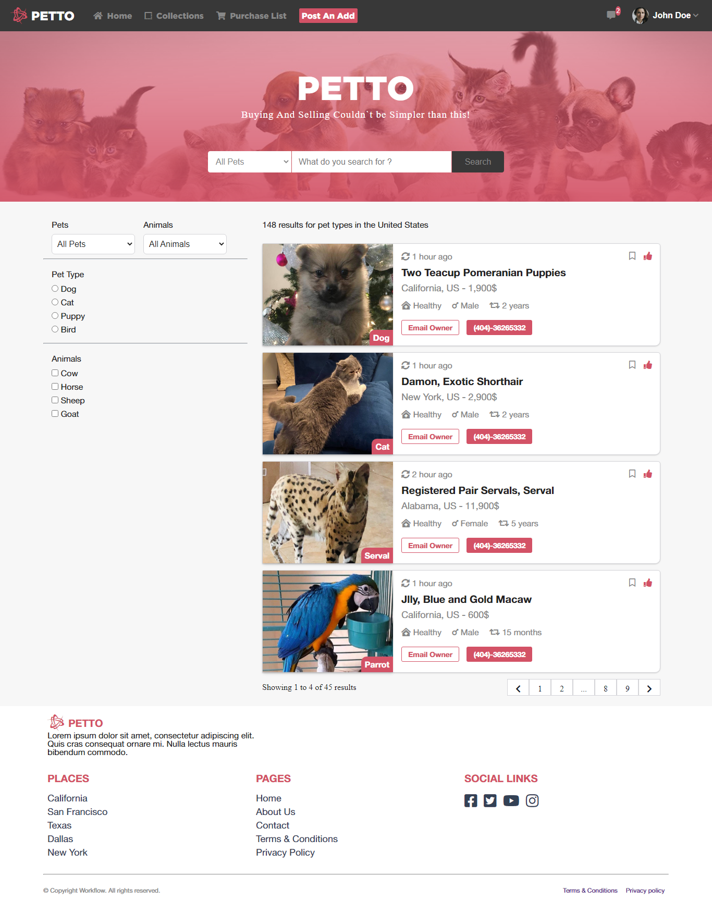

# HTML CSS Capstone project

This project has 2 pages, namely: home page, search page. The website is build using the modern css and html. I have extracted utility classes as much as possible for their reusability purposes.

The website is fully responsive with the help of three media query breakpoints (the default being the smaller viewport), namely: < 768px, >= 768px, >= 1024px, >= 1280px.

### Home page layout

### Search page layout

## Built With

## Live Demo

[Live demo link](https://abeidahmed.github.io/html-css-capstone/)

## Getting Started

To get a local copy up and running follow these simple steps.

- `git clone https://github.com/Murodjon000/electronics-shop`
- `cd electronics-shop`
- `git checkout -b shop`
- `git pull origin shop`
- If you have vscode `live-server` installed, run it and open `localhost:3000`

## Authors

👤 **Murodjon000**

- GitHub: [@Murodjon000](https://github.com/Murodjon000)
- Twitter: [@Murodjon](https://twitter.com/Murodjo91836152)
- LinkedIn: [murodjon-tursunpulatov](https://www.linkedin.com/in/murodjon-tursunpulatov-5189481b3/)

## 🤝 Contributing

Contributions, issues, and feature requests are welcome!

## Show your support

Give a ⭐️ if you like this project!

## Acknowledgments

- [MohammedAwad](https://www.behance.net/gallery/24796463/ZATTIX) for the project guidelines.
- [SuitCSS](https://github.com/suitcss/suit/tree/master/packages/base/) for resetting the browser styling.
- [Fontawesome.com](https://fontawesome.com/) for their well-designed icons.
- [AnimalDirect](https://animal.direct/) for their beautiful images.
- [Microverse](https://www.microverse.org/) for their `README` [template](https://github.com/microverseinc/readme-template).

## 📝 License

Copyright 2020 Murodjon Tursunpulatov

Permission is hereby granted, free of charge, to any person obtaining a copy of this software and associated documentation files (the "Software"), to deal in the Software without restriction, including without limitation the rights to use, copy, modify, merge, publish, distribute, sublicense, and/or sell copies of the Software, and to permit persons to whom the Software is furnished to do so, subject to the following conditions:

The above copyright notice and this permission notice shall be included in all copies or substantial portions of the Software.

THE SOFTWARE IS PROVIDED "AS IS", WITHOUT WARRANTY OF ANY KIND, EXPRESS OR IMPLIED, INCLUDING BUT NOT LIMITED TO THE WARRANTIES OF MERCHANTABILITY, FITNESS FOR A PARTICULAR PURPOSE AND NONINFRINGEMENT. IN NO EVENT SHALL THE AUTHORS OR COPYRIGHT HOLDERS BE LIABLE FOR ANY CLAIM, DAMAGES OR OTHER LIABILITY, WHETHER IN AN ACTION OF CONTRACT, TORT OR OTHERWISE, ARISING FROM, OUT OF OR IN CONNECTION WITH THE SOFTWARE OR THE USE OR OTHER DEALINGS IN THE SOFTWARE.
